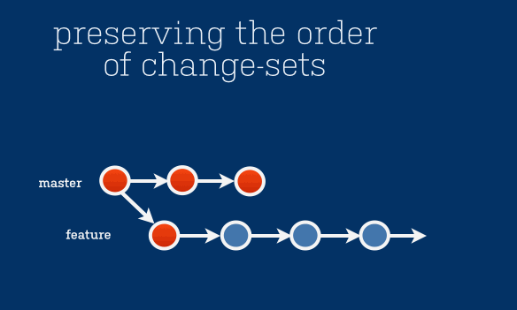

# Rewriting History

## Prerequisites

* Git (2.x)
* (Optional) hub - https://github.com/github/hub
* Fork the repository from https://github.com/feedhenry/git-tutorial


```bash
# Clone the forked repository
git clone git@github.com:<github_username>/git-tutorial.git
```

## Overview

Why rewrite history?

* Git is not only a source control tool, it is also a communication tool
    * Order of commits, logical grouping, good commit messages help to communicate changes
    * Think of the person reviewing your PRs as a potential axe-murderer. Axe murderers hate fix-up commits.
* Golden rule: **Never** rewrite history on shared/public trees

## Rebasing

Rebasing and Merging are two methods that achieve the same goal - the integration of changes from one branch into another branch




### Practical

```bash
cd git-tutorial # From earlier
git fetch
git checkout rebase

# The rebase branch was branched from master a while ago
# It's out of date (master has moved on)
# And there's bad commits in our history that we're going to fixup
git log --pretty=oneline

# First, lets interactively rebase our last 4 commits
git rebase -i HEAD~4 # Note the lack of a branch

# Fix up the commits - think about re-ordering or (s)quashing
# the version bumps and (r)eword the commit messages. 
# Also, delete commits that are of no value
git rebase origin/master

# Alternatively:
# We can do both a history rewrite and a rebase via:
git rebase -i origin/master
```